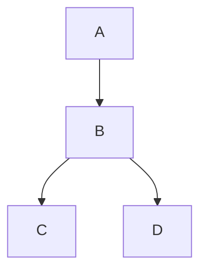
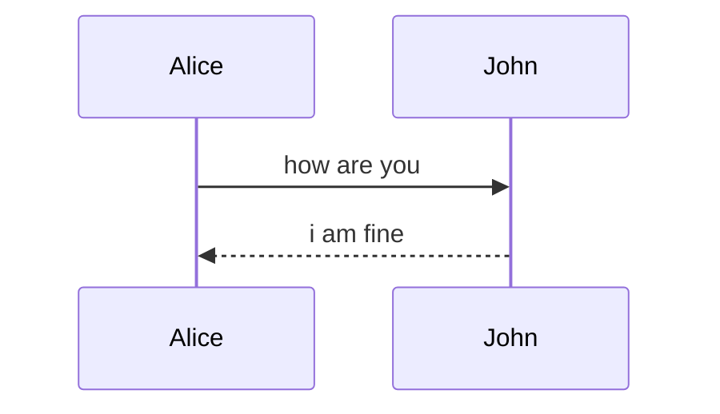
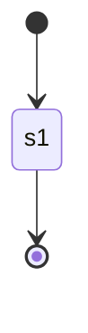
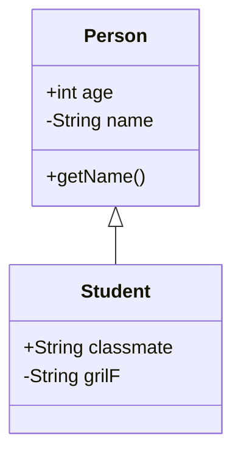
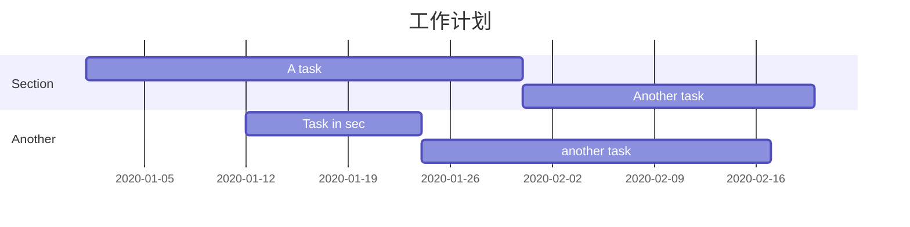
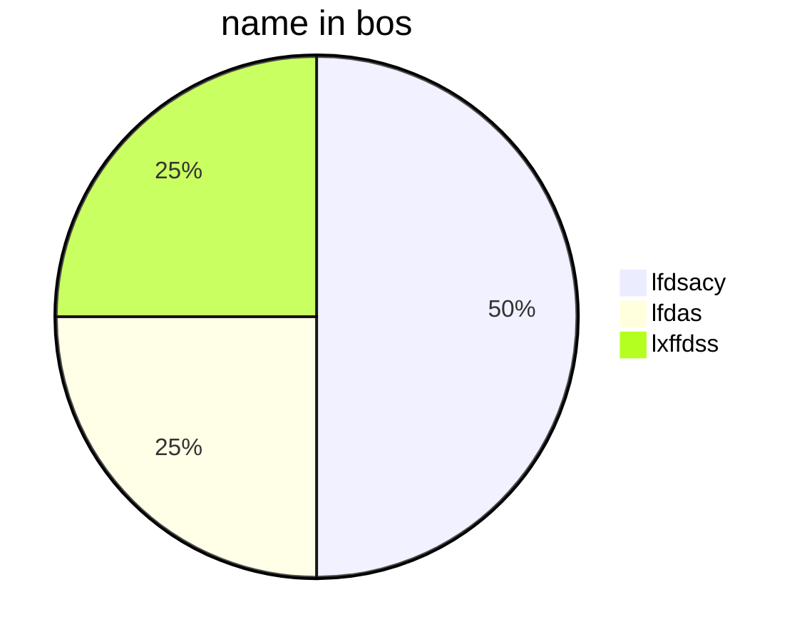

```mermaid
graph TD;
A-->B
B-->C
B-->D
```

```mermaid
sequenceDiagram
Alice->>John: how are you
John-->>Alice: i am fine
```

```mermaid
stateDiagram
[*]-->s1
s1-->[*]
```

```mermaid
classDiagram

Person<|--Student
Person: +int age
Person: -String name
Person: +getName()
class Student{
	+String classmate
	-String grilF
}
```

```mermaid
gantt
title 工作计划
    dateFormat  YYYY-MM-DD
    section Section
    A task           :a1, 2020-01-01, 30d
    Another task     :after a1  , 20d
    section Another
    Task in sec      :2020-01-12  , 12d
    another task      : 24d

```

```mermaid
pie
title name in bos
"lfdsacy":50
"lfdas":25
"lxffdss":25
```

